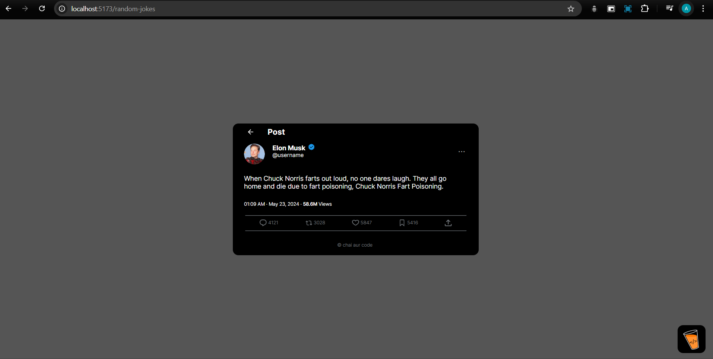

# React Assignment - Vite App

This project contains three different assignments implemented using React and Vite. Each task is accessible through a unique URL route, matching the provided Figma designs precisely. The project is structured to handle API integration, dynamic data rendering, and pagination.

## Live Demo
[Hosted Website Link](masterji-assignment-2.netlify.app)  


## Table of Contents
- [Project Overview](#project-overview)
- [Features](#features)
- [Tasks and Routes](#tasks-and-routes)
- [Getting Started](#getting-started)
- [Screenshots](#screenshots)
- [Technologies Used](#technologies-used)
- [How to Contribute](#how-to-contribute)
- [License](#license)
## Project Overview
This Vite React app includes three main tasks:
1. **Random User Profile** (`/random-user`)

2. **Random Jokes Tweet** (`/random-jokes`)

3. **Cats Listing** (`/cats-listing`)


All routes are designed to match the styling and structure as per the provided Figma designs. The base URL (/) redirects to the Random User Profile route.

## Features
- **Random User Profile**
  - Fetches random user data from an API and displays user details such as name, location, and contact information.
  - Includes a refresh button to fetch the next set of random user data without reloading the page.
  - Hyperlinks for the location and call actions that open the respective services in a new tab.

- **Random Jokes Tweet**
  - Fetches a random joke from an API and displays it in a tweet-like card format.
  - Includes dynamically generated tweet metadata such as timestamp, views, and date to mimic real Twitter analytics.
  - New joke data is fetched and displayed on every page reload, ensuring the content is always fresh.

- **Cats Listing**
  - Fetches and displays a paginated list of cats from an API, with each cat's information shown in a horizontally scrollable card.
  - The list is paginated to manage large data sets, allowing users to browse through different cat profiles efficiently.

## Tasks and Routes
- **Random User Profile**: `/random-user`
- **Random Jokes Tweet**: `/random-jokes`
- **Cats Listing**: `/cats-listing`
- **Base URL Redirect**: `/` redirects to `/random-user`

Clicking the Chai logo opens the [Chaicode website](https://chaicode.com).

## Getting Started
1. **Clone the repository:**
   ```bash
   git clone https://github.com/AppaSapkal01/MasterJi-Assignment-2.git
   cd MasterJi-Assignment-2
   npm install
   npm run dev
   ```
